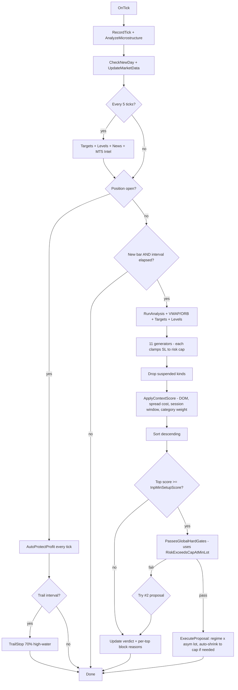
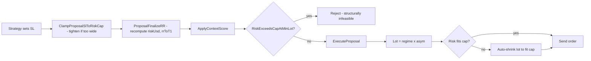

# GOLD-HFT-SCALPER — How it Works

Reference for **`GOLD-HFT-SCALPER.mq5`** (version **1.11**). Pure-algorithmic, no AI, no HTTP, no JSON, no `WebRequest` whitelist needed. Every behaviour is controlled by **Inputs**; defaults are the ones in the file as shipped.

This sits next to `AI-GOLD-SCALPER.mq5` and is **completely independent** (separate magic number `998877`, separate CSV journal `Gold-HFT-Scalper-journal.csv`). You can run both at once on different charts.

> **What's new in v1.11** — production-readiness pass for live deployment (full list in §13):
> 1. **Cached news block** — `BlockNewEntriesDueToHighImpactNews` now reads a flag populated by `CheckEconomicCalendar` instead of issuing `CalendarValueHistory` on every gate check. Eliminates up to 5 redundant API calls per ranker cycle.
> 2. **DOM imbalance toggle (`InpUseDomImbalance`)** — disable the DOM scoring block on retail brokers whose synthetic B-book DOM jitters wildly.
> 3. **R:R ceiling lifted for tight-SL setups** — `ClampProposalSlToRiskCap` now allows up to 8R for SPIKE/NEWS_CONT/FADE (was capped at 4R), so genuinely high-R:R momentum setups no longer get T1 artificially compressed.
> 4. **Close-tag FIFO queue** — `g_LastCloseTag` replaced with an 8-slot queue so partial-close races (TP partial then runner close in the same tick) each get the correct exit tag.
> 5. **ChartRedraw throttling (`InpPanelRedrawEveryN`)** — panel only triggers `ChartRedraw(0)` every N ticks (default 5). Trade fills/closes still force-redraw immediately via `ForceChartRedraw()`.
> 6. **Adaptive retrace widening** — if today's `ARTR` exit count ≥ `InpAdaptiveRetraceTrigger` (default 3), the retrace threshold is multiplied by `InpAdaptiveRetraceMul` (default 1.20). Self-corrects when the regime calms down.
> 7. **Weekend-gap protection (`InpAvoidWeekendGap`)** — Friday after `InpFridayCloseHour` (default 20:00 server) marks session as `WEEKEND_CLOSE`. Existing positions still managed by AutoProtect; new entries blocked.
> 8. **Tick buffer 200 → 500 + dynamic microstructure lookback** — base 30-tick window now expands until it spans ≥ 1 second of data (capped at 250 ticks). Stabilises velocity/acceleration math during NY-open spikes where 200 ticks can fire in <2 sec.
>
> **Carried forward from v1.10**: hybrid SL-clamp + lot auto-shrink risk fix · asymmetric position sizing · per-setup-kind suspension · spread-cost score penalty · DOM imbalance scoring · session-open window flag · ABCD/Level throttle · setup-category prior weights · exit-reason CSV column · diagnostic panel.

---

## 1. Architecture at a glance

The brain is a **Setup Ranker**. Every entry cycle:

1. Eleven **strategy generators** each *propose* 0 or 1 trade.
2. Each proposal carries a numeric **score** = `(strategy raw + universal context bonus) × category prior weight`.
3. Suspended setups (recent consecutive losses) are filtered out.
4. The ranker sorts proposals descending by score.
5. The top proposal must clear **`InpMinSetupScore`** (default `60`) **and** every **global hard gate**.
6. If yes → **`ExecuteProposal`** uses the *strategy-specific* SL, applies asymmetric+regime sizing, and auto-shrinks the lot if risk would exceed the cap.
7. While in a trade, **`AutoProtectProfit`** runs every tick and **`TrailStop`** runs on a timer.



---

## 2. The 11 Strategy Generators

Each generator returns a `SetupProposal` struct: `valid`, `kind`, `name`, `tag`, `isBuy`, `score`, `rawScore`, `ctxScore`, `entryRef`, `stopLoss`, `t1`/`t2`/`t3`, `riskUsd`, `rrToT1`, `factors`.

**Sequence inside every generator (v1.10):**

```text
set entryRef, stopLoss, t1, rawScore, factors
p.valid = true
ClampProposalSlToRiskCap(p)   <- shrinks SL to fit dollar cap, rescales t1 to keep R:R
ProposalFinalizeRR(p)          <- recompute riskUsd / rrToT1 / fill t2/t3
ApplyContextScore(p)           <- universal context bonus + category prior weight
```

| # | Name (kind) | Tag | Fires when… | SL anchor | Raw score |
|---|-------------|-----|-------------|-----------|-----------|
| 1 | **SPIKE** (`SETUP_SPIKE`) | `SPK` | Last M1 body ≥ `InpSpikeBodyAtrMult × ATR(M1)` AND `\|imbalance\| ≥ InpSpikeMinImbalance` AND `\|tickVelocity\| ≥ InpSpikeMinTickVel` AND velocity sign matches body AND `g_Spread ≤ p90 × InpSpikeMaxSpreadP90Mul` | body-mid ± `InpSpikeSlAtrMult × ATR(M1)` | `70` |
| 2 | **FLAG** (`SETUP_FLAG`) | `FLG` | M5 trend strength ≥ `InpFlagMinM5TrendPct`, 1–`InpFlagMaxPullbackBars` consecutive counter-color M5 bars holding M5 EMA9, then break | beyond pullback ± `InpFlagSlAtrMult × ATR(M5)` | `65` |
| 3 | **ORB** (`SETUP_ORB`) | `ORB` | After `InpORBFirstMinutes` window, price breaks ORB high/low; optional retest | opposite ORB side ± `InpORBSlAtrMult × ATR(M5)` | `68` |
| 4 | **VWAP_RECLAIM** (`SETUP_VWAP_RECLAIM`) | `VWR` | Last M1 wicked through VWAP and closed back, with min displacement `InpVWAPMinDistPts` | beyond the wick + `InpVWAPSlAtrMult × ATR(M5)` | `60` |
| 5 | **VWAP_REJECT** (`SETUP_VWAP_REJECT`) | `VWJ` | Last M1 touched VWAP and rejected back into the M5 trend | VWAP ± `InpVWAPSlAtrMult × ATR(M5)` | `60+5` |
| 6 | **ABCD** (`SETUP_ABCD`) | `ABC` | M5 ABCD over 10 bars; A→B impulse ≥ points, B→C `[InpABCDPullbackMin..Max]`, D continuation. **NEW in v1.10:** requires `g_M5ADX ≥ InpABCDMinADX` (default 22). | C extreme ± `InpABCDSlAtrMult × ATR(M5)` | **`74`** (was 62) |
| 7 | **LEVEL_BOUNCE** (`SETUP_LEVEL_BOUNCE`) | `LBN` | Last M1 wicked into closest support/resistance and closed back. **NEW in v1.10:** requires `g_M5ADX ≥ InpLevelMinADX` OR `g_Levels.nearMagnet`. | beyond the level ± `InpLevelSlAtrMult × ATR(M5)` | **`72+4`** (was 60+4) |
| 8 | **LEVEL_BREAK** (`SETUP_LEVEL_BREAK`) | `LBR` | Last M1 closed past a level by ≤ `InpLevelMaxDistPts`, body ≥ `0.8 × ATR(M1)`. Same ADX/magnet requirement as Bounce. | the broken level ± `InpLevelSlAtrMult × ATR(M5)` | **`72+6`** |
| 9 | **EMA_PULLBACK** (`SETUP_EMA_PULLBACK`) | `EMA` | Established M5 trend; touches EMA9 (M5) or EMA20 (M15) within `InpEMAPullbackMaxPts` and closes back | beyond MIN(EMA, pullback) ± `InpEMAPullbackSlAtrMult × ATR` | `58` |
| 10 | **NEWS_CONT** (`SETUP_NEWS_CONT`) | `NWC` | High-impact event passed in last `InpNewsContMaxSecAfter` seconds, AND last M1 body ≥ `InpNewsContBodyAtrMult × ATR(M1)` | bar low/high ± `InpNewsContSlAtrMult × ATR(M1)` | `75` + freshness |
| 11 | **FADE** (`SETUP_FADE`) | `FAD` | RSI extreme + magnet + microstructure exhaustion. **DISABLED by default** (`InpEnableFade=false`) | bar low/high ± `InpFadeSlAtrMult × ATR(M1)` (very tight) | `55` |

> Each generator can be enabled/disabled with its own `InpEnable…` boolean.
> **v1.10:** any generator whose setup-kind is currently in suspension cooldown is silently dropped from `CollectProposals`.

---

## 3. Risk-cap fix (HYBRID) — the v1.10 headline change

The v1.00 backtest blocked 100% of high-score trades with `risk $X.XX > cap $4.75`, because some strategies (notably VWAP, ABCD, Level) place SLs well past `cap_$ / dollarsPerPoint(InpLotSize)`. v1.10 fixes this in two layers:

**Layer A — `ClampProposalSlToRiskCap(p)` (per strategy)**

After every strategy sets its SL+T1, we clamp the SL distance to `capUsd / dollarsPerPriceUnit()`. If the SL was wider, we pull it closer to entry to fit and **rescale T1 to preserve the original R:R**. If the post-clamp SL would sit inside the broker's `SYMBOL_TRADE_STOPS_LEVEL`, the proposal is invalidated.

**Layer B — Auto-shrink lot in `ExecuteProposal`**

The planned lot is `LotForRegime() × AsymmetricMultiplier(score)`, snapped to broker volume step. If the resulting risk still exceeds cap × 1.05 (e.g. when regime mul > 1, or asym mul = 1.0 on a wider stop), `tradeLot` is shrunk to `(cap × 0.98) / riskPerLotUsd`. Only if the shrunk lot is below `SYMBOL_VOLUME_MIN` is the trade rejected.

**Layer C — `PassesGlobalHardGates` no longer over-rejects**

The cap check now uses `RiskExceedsCapAtMinLot(p, cap)` — *only* fail if even the broker's minimum tradable lot still overflows the cap. Salvageable proposals are passed through to `ExecuteProposal` for auto-shrink.



---

## 4. The Universal Point System (v1.10 expanded)

Inside every generator after the strategy raw score is set, **`ApplyContextScore()`** adds a confluence bonus that's the same for all setups, then applies a category-prior weight.

**Final formula:** `score = (rawScore + ctxBonus) × SetupCategoryWeight(kind)`

```text
HTF confluence
  M15 aligns                                          +12
  M15 against                                         -15
  H1 aligns                                           +8
  H1 against                                          -10
  M15 + H1 both align                                 +5

ADX (M5)
  ADX ≥ 28                                            +10
  ADX 20-28                                           +5
  ADX < 18 (and not Fade / VWAP_RECLAIM)              -6

Microstructure
  Order-flow imbalance with direction (>20%)          +12
  Order-flow imbalance against                        -10
  Tick velocity with direction (>8 pts/s)             +8

Volatility regime
  NORMAL or ELEVATED                                  +8
  EXPLOSIVE (Spike or News-Cont)                      +12
  EXPLOSIVE (other setups)                            -4
  QUIET (and not VWAP_RECLAIM / Fade)                 -10

VWAP context
  Price on the correct side of VWAP                   +6
  Wrong side                                          -4

Spread quality (binary)
  ≤ 25 pts                                            +5
  Spike vs rolling p90                                -15

** NEW v1.10 Spread cost vs T1 distance
  spread/tDist > 25%                                  -12  (extreme)
  15% < ratio ≤ 25%                                   -7
  8% < ratio ≤ 15%                                    -3

** NEW v1.10 DOM imbalance (g_DomImbalancePct)
  |imb| ≥ 60% AND aligned                             +8
  |imb| ≥ 60% AND against                             -6
  40 ≤ |imb| < 60 AND aligned                         +3
  40 ≤ |imb| < 60 AND against                         -2

** NEW v1.10 Session-open window (first InpSessionOpenWindowMin minutes)
  In window AND SPIKE/NEWS_CONT                       +6
  In window AND FLAG/ABCD                             -4

Magnet proximity
  Near a magnet (and not Level/Fade)                  -10

News
  Blackout (and not News/Spike)                       -30  (effectively kills it)
  Calendar clear / next event > 60 min                +3

Recent-loss penalty
  ≥ 2 recent losses (in last 5)                       -6
  ≥ 2 consecutive losses                              -8

** NEW v1.10 Setup category prior weight (multiplicative)
  SPIKE / NEWS_CONT             × 1.12  (rare, high conviction)
  FLAG / EMA_PULLBACK / ORB     × 0.95  (frequent, moderate)
  others                        × 1.00
```

A setup must reach **`InpMinSetupScore`** (default `60`) to be considered.

---

## 5. Asymmetric position sizing (v1.10)

The executed lot is **scored**: `tradeLot = InpLotSize × LotForRegime() × AsymmetricMultiplier(score)`.

| Score band | Multiplier (input) | Default |
|---|---|---|
| 60–74 (weakest tradeable) | `InpAsymMul_60_75` | **0.50** |
| 75–84 (good) | `InpAsymMul_75_85` | **0.75** |
| 85+ (A+ setup) | `InpAsymMul_85_plus` | **1.00** |

Disable with `InpAsymSize = false` to fall back to flat sizing.

`LotForRegime` keeps the prior-version regime multipliers (Quiet/Explosive 0.5×, Normal/Elevated 1.0×).

---

## 6. Per-setup-kind suspension (v1.10)

When a trade closes as a loss, we increment that setup-kind's loss streak. After **2 consecutive losses on the same kind** (`InpSuspendAfter2Losses`), that kind is suspended for **`InpSuspendDurationMin`** minutes (default 45). Suspended kinds are silently filtered out by `CollectProposals` until the cooldown expires; the **panel** lists which setups are currently suspended and their resume countdown. Wins reset the streak.

---

## 7. The Ranker

`RunRanker()`:

1. `CollectProposals` calls all 11 generators; suspended kinds are filtered out (v1.10).
2. Insertion-sorts descending by score.
3. `StoreTopForPanel` stores top 3 AND **pre-computes the gate result + reason for each** (v1.10) so the panel can show *why* each top would or wouldn't fire.
4. Logs the top-N to the CSV (`RANKER` event).
5. If `top.score < InpMinSetupScore` → verdict `BELOW_THRESH (X.X < Y.Y)`.
6. Otherwise tries #1 then #2 through `PassesGlobalHardGates`. First pass → `ExecuteProposal`.
7. Verdicts: `FIRED <name>`, `GATED <name> (<reason>)`, `BELOW_THRESH (...)`, `NO_PROPOSAL`, `REJECTED ... (risk too high even at min lot)` (v1.10).

---

## 8. Global Hard Gates (v1.10 risk-cap relaxation)

These run **after** the ranker has chosen a winner:

- `g_Spread > InpEntryMaxSpreadPts` — too wide.
- `InpBlockEntryOnSpreadSpike && g_SpreadSpike` — spread > 1.25 × p90.
- Halted, daily loss breached, consecutive losses cap, cooldown after loss, cooldown after close.
- Session closed (and `InpUseSessionFilter`).
- `BlockNewEntriesDueToHighImpactNews()` — within news window. **News-Cont exempt**.
- RSI caps. **Fade exempt**.
- `InpBlockM15VsTrade` / `InpBlockH1VsTrade`. **Spike, News, Fade exempt**.
- M1-align filter. Same exemptions.
- `p.rrToT1 < InpMinRRToFirstTarget` — risk:reward floor.
- **NEW v1.10 risk cap:** `RiskExceedsCapAtMinLot(p, cap)` — only fail if even the broker minimum lot can't fit. Salvageable proposals continue to `ExecuteProposal` which auto-shrinks the lot.

If all pass → **`ExecuteProposal`**.

---

## 9. Execution & Cut-Losses-Short

**`ExecuteProposal(p)`** — the *only* entry point that opens orders:

1. Cap the SL distance to `OrderRiskDollars()` (legacy safety; clamp already did this).
2. Honour `SYMBOL_TRADE_STOPS_LEVEL` minimum.
3. Compute `tradeLot = LotForRegime() × AsymmetricMultiplier(p.score)`, snap to broker volume step.
4. Compute `riskUsdAtSl`. If > cap × 1.05, **auto-shrink** to `(cap × 0.98) / riskPerLotUsd`. If < broker min lot → reject.
5. Build order comment: `<TAG>-<SCORE>-<B|S>:<short factors>`. Truncated to `InpOrderCommentMaxLen`.
6. `g_Trade.Buy/Sell`. Print includes `regime × asym = lot` and an `auto-shrunk` line when active.
7. On success: stash `g_OpenSetupKind`, `g_OpenSetupName`, `g_OpenSetupScore`.

---

## 10. Auto-Protect — every-tick defense

`AutoProtectProfit()` runs on **every** tick. Each rule logs an exit-tag (now mirrored to the CSV `exit_reason=` column in v1.10):

| Tag | Rule | Trigger |
|---|---|---|
| `ATIM` | Hard time-stop | open ≥ N sec, `\|P/L\| ≤ InpHardTimeStopMinAbsUsd`, never armed green (off by default) |
| `ANRD` | NORED | once `g_MaxProfit ≥ InpAPGreenArmUsd`, any move into red closes |
| `ARTR` | Universal retrace | peak-drop ≥ `InpAPRetraceChopUsd` (chop) or `InpAPRetraceRunUsd` (run) |
| `ABNK` | Auto-bank | not in a run AND profit ≥ `InpAPScalpBankUsd` |
| `AGVE` | Gave-back | peak ≥ $4 and current < peak − $2 |
| `AEMR` | Winner→red | peak ≥ $2.50 and current ≤ −`InpAPWinnerGoneRedUsd` |
| `ACUT` | Good start gone bad | peak ≥ $2 and current ≤ −$0.75 |
| `MPRT` | Partial close | manual `TradeCloseWithComment(...partVol, "MPRT", ...)` |
| `SL` / `TP` / `MAN` / `OTH` | Broker-side close | parsed from broker deal comment |

A **Run** = M5 trend in trade direction AND `g_M5MomentumOK` AND `g_M5TrendPct ≥ InpAPRunnerM5StrengthPct`.

`TrailStop()` runs every `InpAPTrailIntervalSec` seconds. Pure 70% high-water — never gives back > 30% of MAX, never moves SL backward.

---

## 11. Inputs reference

### Trade
| Input | Default | Notes |
|---|---|---|
| `InpLotSize` | `0.01` | Base lot (scaled by regime + asym below) |
| `InpLotMulQuiet` | `0.5` | Regime mul (Quiet — cut size) |
| `InpLotMulNormal` | `1.0` | Regime mul (Normal — full) |
| `InpLotMulElevated` | `1.0` | Regime mul (Elevated — full) |
| `InpLotMulExplosive` | `0.5` | Regime mul (Explosive — slip risk, cut) |
| **`InpAsymSize`** | `true` | **NEW** asymmetric sizing on/off |
| **`InpAsymMul_60_75`** | `0.50` | **NEW** lot mul for score 60-74 |
| **`InpAsymMul_75_85`** | `0.75` | **NEW** lot mul for score 75-84 |
| **`InpAsymMul_85_plus`** | `1.00` | **NEW** lot mul for score 85+ |
| `InpMaxRiskDollars` | `6.00` | Hard $ cap. Also clamped by `g_Targets.minProfit × InpMaxRiskVsMinTargetMult`. |
| `InpEntryNewBarTimeframe` | `PERIOD_M1` | |
| `InpEntryIntervalSec` | `3` | Min seconds between ranker cycles |

### Ranker
`InpMinSetupScore` (60), `InpMinRRToFirstTarget` (1.10), `InpRankerLogTopN` (3), `InpVerboseSkips` (true).

### Per-strategy enable + tuning
- `InpEnableSpike`, `InpSpikeBodyAtrMult` (1.8), `InpSpikeMinImbalance` (35), `InpSpikeMaxSpreadP90Mul` (1.10), `InpSpikeMinTickVel` (8), `InpSpikeSlAtrMult` (0.6), `InpSpikeRawScore` (70).
- `InpEnableFlag`, `InpFlagMinM5TrendPct` (70), `InpFlagMaxPullbackBars` (4), `InpFlagMinPullbackBars` (1), `InpFlagSlAtrMult` (1.0), `InpFlagRawScore` (65).
- `InpEnableORB`, `InpORBFirstMinutes` (15), `InpVWAPAnchorMode` (0=midnight, 1=London), `InpORBRequireRetest` (false), `InpORBSlAtrMult` (1.1), `InpORBRawScore` (68).
- `InpEnableVWAPReclaim`, `InpEnableVWAPReject`, `InpVWAPMinDistPts` (20), `InpVWAPSlAtrMult` (1.0), `InpVWAPRawScore` (60).
- `InpEnableABCD`, `InpABCDImpulseMinPts` (60), `InpABCDPullbackMin/Max` (0.30/0.70), `InpABCDSlAtrMult` (1.0), **`InpABCDRawScore` (74, was 62)**, **`InpABCDMinADX` (22) NEW**.
- `InpEnableLevelBounce`, `InpEnableLevelBreak`, `InpLevelMaxDistPts` (30), `InpLevelSlAtrMult` (0.9), **`InpLevelRawScore` (72, was 60)**, **`InpLevelMinADX` (22) NEW**.
- `InpEnableEMAPullback`, `InpEMAPullbackTF` (M5), `InpEMAPullbackMaxPts` (25), `InpEMAPullbackSlAtrMult` (1.0), `InpEMAPullbackRawScore` (58).
- `InpEnableNewsCont`, `InpNewsContMaxSecAfter` (180), `InpNewsContBodyAtrMult` (1.2), `InpNewsContSlAtrMult` (0.9), `InpNewsContRawScore` (75).
- `InpEnableFade` (**false** by default), `InpFadeRsiLongCap` (22), `InpFadeRsiShortFloor` (78), `InpFadeRequireMagnet` (true), `InpFadeRequireExhaustion` (true), `InpFadeSlAtrMult` (0.5), `InpFadeRawScore` (55).

### Hard Gates
`InpEntryMaxSpreadPts` (40), `InpBlockEntryOnSpreadSpike` (true), `InpBlockM15VsTrade` (true), `InpBlockH1VsTrade` (false), `InpRsiBlockLongAbove` (75), `InpRsiBlockShortBelow` (25), `InpUseM1AlignFilter` (true), `InpM1AlignBars` (3), `InpUseClosedM1RsiForEntry` (true), `InpRSIPeriod` (7), **`InpUseDomImbalance` (true) NEW v1.11** — disable on retail brokers w/ synthetic DOM if you see the DOM bonus oscillating wildly.

### Auto-Protect
All as in v1.00 with the v1.10 mid-ground defaults already applied:
- `InpAPRunnerM5StrengthPct` (60.0)
- `InpAPScalpBankUsd` (1.20), `InpAPGreenArmUsd` (0.50)
- `InpAPRetraceChopUsd` (0.40), `InpAPRetraceRunUsd` (0.60)
- `InpAPMicroLockFromUsd` (0.80), `InpAPWinnerGoneRedUsd` (0.30)
- `InpHardTimeStopSec` (0 = off), `InpAPTrailIntervalSec` (5)
- **NEW v1.11 — adaptive retrace**:
  - `InpAdaptiveRetrace` (true) — auto-widen retrace tolerances when ARTR is over-firing today.
  - `InpAdaptiveRetraceTrigger` (3) — number of ARTR exits today before widening kicks in.
  - `InpAdaptiveRetraceMul` (1.20) — multiplier applied to chop/run retrace thresholds when triggered (1.20 = +20% slack).

### Profit / SL targets
`InpQuickProfitMin` (1.50), `InpQuickProfitGood` (2.50), `InpQuickProfitGreat` (5.00), `InpStopLossDollars` (3.00), `InpPartialPercent` (60), `InpOrderSLFromDynamicTargets` (true), `InpCapOrderRiskToMinProfit` (true), `InpMaxRiskVsMinTargetMult` (0.95), ATR multipliers.

### Risk
`InpMaxDailyLoss` (50), `InpMaxConsecLosses` (0=off), `InpCooldownAfterLoss` (20), `InpCooldownAfterClose` (20), **`InpSuspendAfter2Losses` (true) NEW**, **`InpSuspendDurationMin` (45) NEW**, **`InpDailyProfitTarget` (20.0) NEW** (panel reference only).

### Sessions / News
`InpUseSessionFilter` (true), `InpLondonStart` (8), `InpLondonEnd` (16), `InpNYStart` (13), `InpNYEnd` (21), **`InpSessionOpenWindowMin` (15) NEW v1.10**, **`InpAvoidWeekendGap` (true) NEW v1.11**, **`InpFridayCloseHour` (20) NEW v1.11** — Friday weekend-gap protection (`g_Session = WEEKEND_CLOSE` after this hour, no new entries; existing positions still managed by AutoProtect), news fields.

### Logging
`InpEnableCsvLog` (true), `InpCsvLogFile` (`GOLD-HFT-SCALPER\Logs\Gold-HFT-Scalper-journal.csv`).

### Display
`InpShowPanel` (true), **`InpPanelX` (10) NEW v1.10**, **`InpPanelY` (25) NEW v1.10**, **`InpPanelWidth` (380) NEW v1.10**, **`InpPanelRedrawEveryN` (5) NEW v1.11** (panel only triggers `ChartRedraw(0)` every N ticks; trade fills/exits force-redraw immediately via `ForceChartRedraw()`), color inputs.

---

## 12. New Diagnostic Panel (v1.10)

380×~840 pixels, 6 sections plus footer.

```
┌────────────────────────────────────────┐
│  GOLD-HFT-SCALPER v1.10                │
│  9-strategy ranker                     │
├────────────────────────────────────────┤
│ ▼ TRADE                                │
│  Status:    BUY 0.01 lot               │
│  Setup:     SPIKE (87)                 │
│  Entry/SL:  2403.45 / 2402.80          │
│  T1/RR:     2404.55 / 1.7              │
│  P/L:       +$1.42                     │
│  Best/Age:  $1.85 / 24s                │
├────────────────────────────────────────┤
│ ▼ RANKER                               │
│  Verdict:  FIRED SPIKE                 │
│  Next/Cnt: in 2s | last cycle: 4       │
│  #1 SPIKE  87  B  RR1.7                │
│      PASS                              │
│  #2 ORB    74  B  RR1.5                │
│      M15 bullish (block short)         │
│  #3 FLAG   62  B  RR1.3                │
│      below threshold                   │
├────────────────────────────────────────┤
│ ▼ MARKET                               │
│  M15/H1:   UP / —                      │
│  M5/ADX:   ▲ UP 78% / ADX 24.3         │
│  Regime:   TREND_NORMAL                │
│  Session:  NY ●  (closes 142m)         │
│  OpenWin:  NY +08m (boost SPK/NEWS)    │
│  Spread:   22 pts ✓                    │
│  DOM imb:  +47% (bid lean)             │
│  ATR M1/5: $1.85 / $4.20               │
├────────────────────────────────────────┤
│ ▼ TODAY                                │
│  P/L:      +$8.40                      │
│  ████████████░░░░░░░░░░  vs $20        │
│  W/L Avg:  4/6 (67%)  +$3.10 / -$1.80  │
│  Exits:    BNK×2  RTR×1  NRD×1  SL×2   │
├────────────────────────────────────────┤
│ ▼ SUSPENDED                            │
│  ABCD: resumes in 31m23s               │
│  (no other setups suspended)           │
├────────────────────────────────────────┤
│ ▼ RISK                                 │
│  Cap/trade: $4.75  (max $6.00)         │
│  Halt:      ░░░░░░░░░░░░░░░░░░         │
├────────────────────────────────────────┤
│ v1.10 | TF=M1 | cycle 3s | min 60      │
└────────────────────────────────────────┘
```

**What's new vs the v1.00 panel:**
- Wider (380 vs 290) so labels don't truncate.
- `[TRADE]` shows entry/SL/T1/RR + age in seconds.
- `[RANKER]` shows the **full block reason** for each of the top 3 (no more 22-char truncation), plus a live "next cycle in Xs" countdown and last-cycle proposal count.
- `[MARKET]` adds **DOM imbalance**, **ATR M1/M5**, and the **session-open-window** indicator.
- `[TODAY]` adds a daily-P/L progress bar (vs `InpDailyProfitTarget`), avg-win / avg-loss, and an **exit-reason mini-tally** (BNK×2 RTR×1 NRD×1 SL×2 …).
- `[SUSPENDED]` lists every setup currently in cooldown with time-until-resume; auto-collapses to "(no setups suspended) ✓" when nothing is locked out.
- `[RISK]` shows the live dynamic cap and a daily-halt usage bar.

---

## 13. CSV journal

Path: `<MT5 Data Folder>\MQL5\Files\GOLD-HFT-SCALPER\Logs\Gold-HFT-Scalper-journal.csv`

Open via MT5 menu: `File → Open Data Folder → MQL5\Files\GOLD-HFT-SCALPER\Logs\`. The EA auto-creates the subfolders on the first event.

Header:

```
utc_ts;event;symbol;regime;score;spread_pts;primary;secondary;detail
```

Notable events:

| event | when | columns of interest |
|---|---|---|
| `RANKER` | every cycle that produced ≥ 1 proposal | `primary` = `<n> proposals`, `detail` = `NAME=score[rr=x] ...` |
| `ENTRY_FILL` | proposal accepted, order filled | `primary` = `BUY/SELL`, `secondary` = strategy name, `detail` = `score=x;rr=y;riskUsd=z;order=...;posId=...` |
| `EXIT_WIN` / `EXIT_LOSS` | trade closed | `primary` = `$P/L`, `secondary` = position id, `detail` = broker close comment + `open_setup=<name>;open_score=<x>;open_reg=<regime>;exit_reason=<TAG>` **(v1.10)** |

The new `exit_reason=<TAG>` field lets you compute exit-quality stats without parsing broker comments. After 50 trades you can group by tag and immediately see whether `RTR` is closing winners early in trends, `SL` is hitting too often in chop, etc.

---

## 14. v1.00 → v1.10 changelog (summary)

| Area | v1.00 | v1.10 |
|---|---|---|
| Risk cap | `p.riskUsd > cap` killed all wide-SL setups | Hybrid: clamp SL → auto-shrink lot → reject only if min lot can't fit |
| Sizing | Flat `InpLotSize` | Regime × asymmetric (score-band) multipliers, snapped to broker step |
| Suspension | Global `InpMaxConsecLosses` only | Per-setup-kind 2-loss → 45-min cooldown, panel surfaces it |
| Spread | Binary tight/spike bonus | Adds spread-vs-target-distance penalty (-3 / -7 / -12) |
| DOM | Collected, unused | Wired into context: ±8 at ≥60% imbalance, ±3 at 40-60% |
| Session | Bias only (open or closed) | Open-window flag boosts SPK/NEWS, penalizes FLG/ABCD in first 15 min |
| ABCD/Level | Could fire in chop | Require `M5_ADX ≥ 22` (Level: OR magnet); raw scores raised |
| Category prior | None | ×1.12 rare/conviction, ×0.95 frequent/moderate |
| Exit reason | Only in deal comment | Explicit `exit_reason=<TAG>` CSV column + in-memory tally |
| Panel | 290×640 single-col | 380×~840 6-section dashboard with progress bars + per-top reasons + suspended list |

### v1.10 → v1.11 (production-readiness pass)

| Area | v1.10 | v1.11 |
|---|---|---|
| News block | `BlockNewEntriesDueToHighImpactNews` issued `CalendarValueHistory` per call (×5 / cycle) | Cached boolean `g_NewsHighImpactBlockActive` populated by `CheckEconomicCalendar` (1× / minute) |
| DOM scoring | Always-on; noisy on retail synthetic DOM | Gated by `InpUseDomImbalance` + `g_MarketBookSubscribed` |
| R:R cap in clamp | Hard 4.0 ceiling for all setups | 8.0 for SPIKE/NEWS_CONT/FADE; 4.0 for pattern setups |
| Close-tag tracking | Single `g_LastCloseTag` string (race on partials) | 8-slot FIFO queue (`PushCloseTag`/`PopCloseTag`) |
| Panel redraw | `ChartRedraw(0)` on every tick | Throttled by `InpPanelRedrawEveryN` + `ForceChartRedraw()` on entry/exit events |
| Retrace tolerance | Static `InpAPRetraceChopUsd` / `InpAPRetraceRunUsd` | Adaptive: ×`InpAdaptiveRetraceMul` when today's ARTR exits ≥ `InpAdaptiveRetraceTrigger` |
| Weekend gap | No protection | `InpAvoidWeekendGap` blocks new entries Friday after `InpFridayCloseHour` |
| Tick buffer | `MAX_TICKS = 200` ; fixed 30-tick microstructure window | `MAX_TICKS = 500`; window expands until ≥ 1 second of data, capped at 250 |

---

## 15. Tuning hints

- **Want more action.** Lower `InpMinSetupScore` to 50, set `InpAsymMul_60_75` to 0.75 (so weaker setups still trade meaningful size), set `InpEntryIntervalSec` to 1.
- **Want only the cleanest entries.** Raise `InpMinSetupScore` to 80, leave asymmetric sizing on (so only A+ setups get full size), set `InpBlockH1VsTrade = true`.
- **Trim losing setups.** Disable via its `InpEnable…` boolean OR drop its `InpXXXRawScore` 10–15. Or just let v1.10's auto-suspension handle it after 2 losses.
- **HFT-aggressive cut-losses.** Set `InpHardTimeStopSec = 90` and `InpHardTimeStopMinAbsUsd = 0.15`.
- **Calmer when news heavy.** Raise `InpHighImpactNewsBeforeMin` to 30, `InpHighImpactNewsAfterMin` to 20.
- **Spike-only mode.** Disable everything except `InpEnableSpike` and `InpEnableNewsCont`. Lower `InpMinSetupScore` to 50.
- **Trend-day mode.** Disable `Fade`, `LevelBounce`, `VWAPReclaim`. Raise `InpFlagRawScore` and `InpEMAPullbackRawScore` by 10. Lower `InpAPRetraceRunUsd`.
- **Per-strategy expectancy.** After a few sessions, group `EXIT_*` rows in the CSV by `secondary` (= strategy name) AND `exit_reason` (in the `detail` column). Disable any setup with negative expectancy or a high `SL` rate; widen retraces if `RTR` dominates the wins.

---

## 16. Non-goals

- No machine-learning, no neural net, **no remote calls**.
- No multi-symbol logic — tuned for **XAUUSD**; works on any chart timeframe (M1 recommended).
- Does **not** modify `AI-GOLD-SCALPER.mq5` in any way.
- Default `InpMaxPositions = 1` — no pyramiding.

The **`.mq5` is the source of truth** if anything in this document disagrees.

